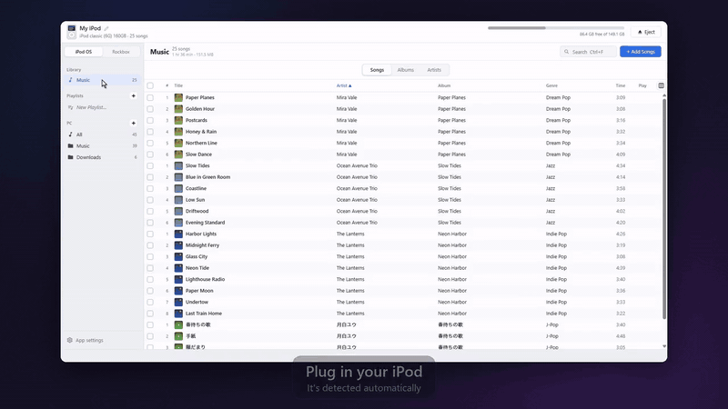
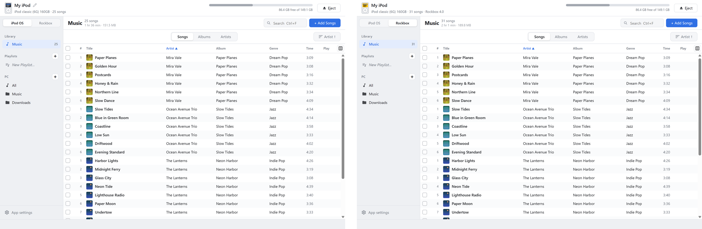
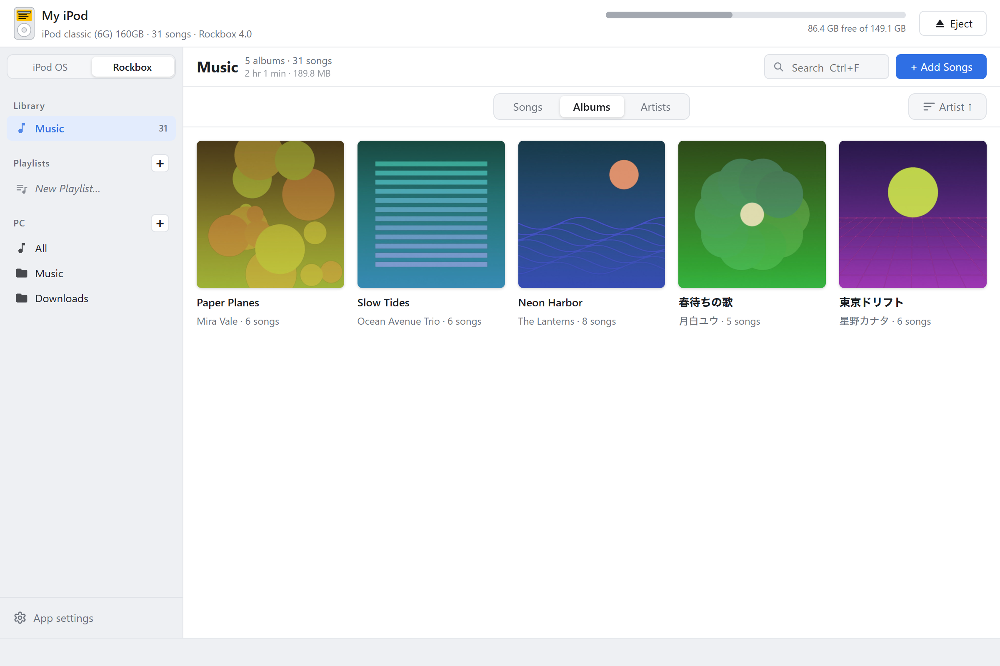
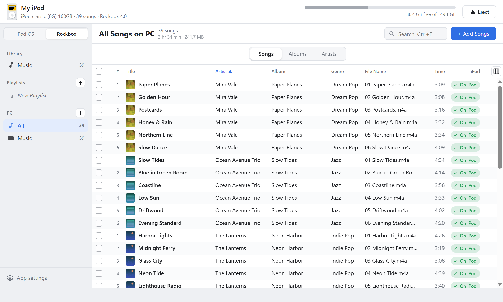
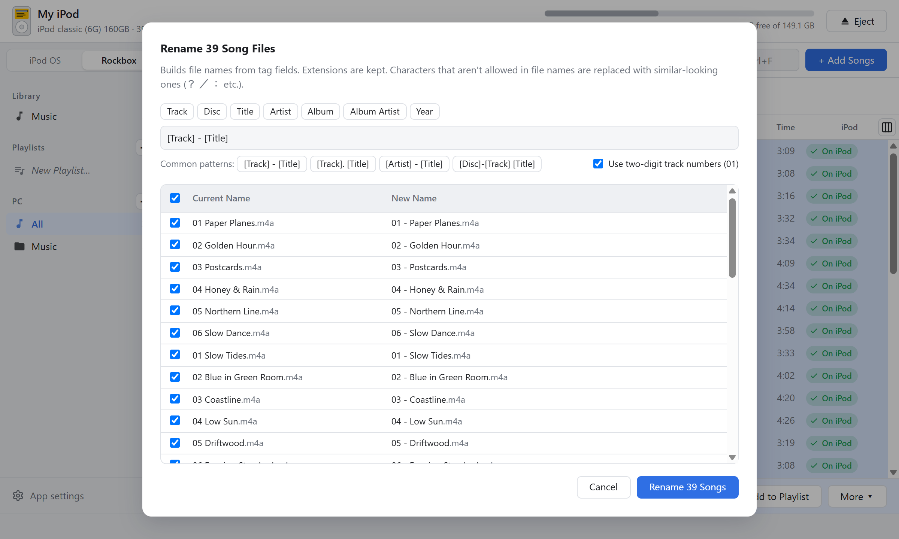
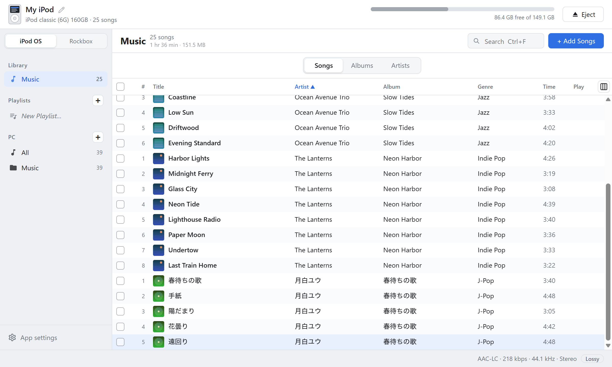
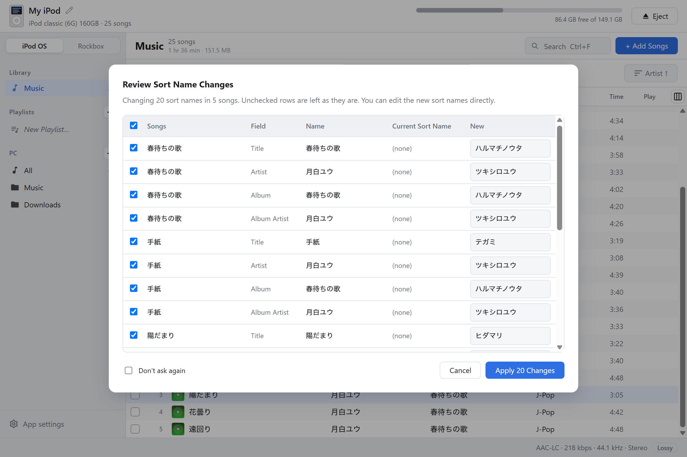
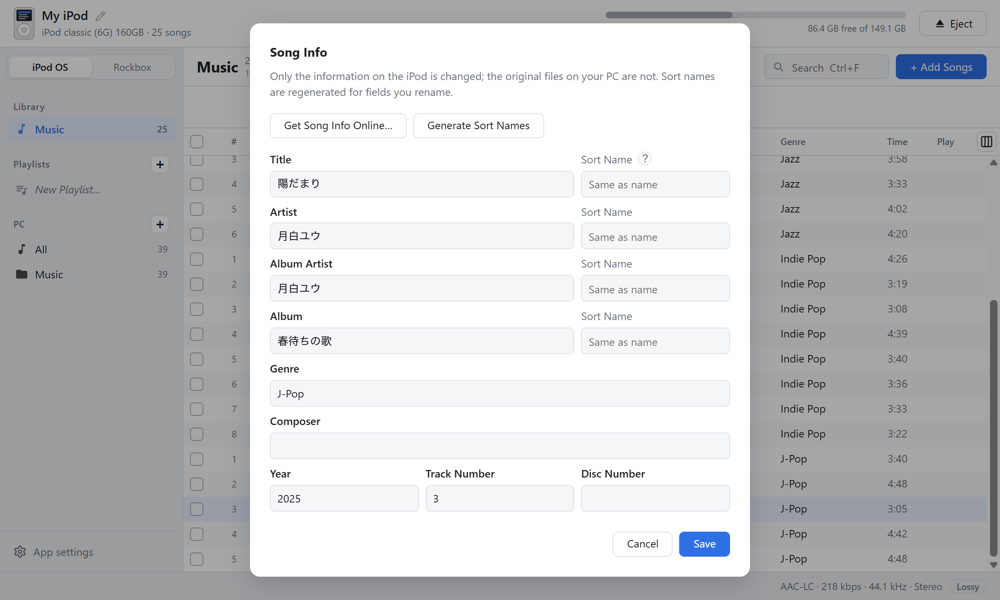
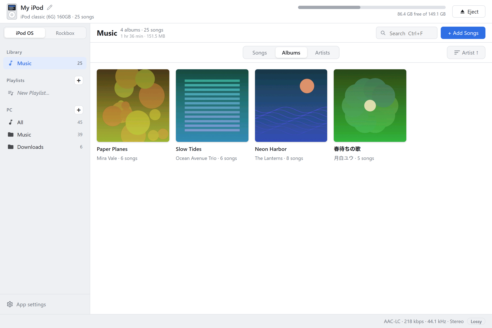

# ZenPod: iPod classic Manager for iPod OS & Rockbox

**Manage your iPod classic — with the stock iPod OS or with Rockbox.**

A music manager for iPods that supports both iPod OS (Apple's firmware) and Rockbox. 
Drag and drop songs onto your iPod, and tidy up the music files on your PC too. No iTunes needed.

For Windows and macOS. **Completely free** — no ads, no paid features, no account needed

[**Download**](https://github.com/ishiichan-dayo/ZenPod/releases/latest) · [日本語](README.md)

[Watch the intro video (72 s, with sound)](https://github.com/ishiichan-dayo/ZenPod/releases/download/v1.0.0/zenpod-intro-en.mp4)

---

## iPod OS or Rockbox — your choice

Switch between "iPod OS | Rockbox" at the top left to manage the same iPod in two ways. In both modes you can drop songs to transfer them, edit song info, and create and reorder playlists.

- **iPod OS**: songs are added to Apple's firmware library (iTunesDB), just like with iTunes
- **Rockbox**: songs are kept as plain files, neatly organized as `Music/Artist/Album/01 Title.flac`. **FLAC, Ogg and Opus go over as-is** — no conversion. You can rearrange the folder layout under "Transfer" in Settings by dragging parts such as artist and album (or pick one of the common layouts), and for an iPod that already has songs, the app suggests a layout that matches how they're organized
- **Both on one iPod**: on a dual-boot iPod with Rockbox installed, you can keep songs for iPod OS and songs for Rockbox side by side. The mode is remembered per iPod

### The Rockbox database, built on your PC

Building the database on the iPod itself can take a long time with a large library. ZenPod **builds a database in the same format as Rockbox 4.0 on your PC** every time you add songs. Eject the iPod and you can browse by artist and album under "Database" right away.

- Play counts and ratings recorded on the iPod are kept when the database is rebuilt
- Adding or removing songs in iPod OS mode also updates the Rockbox database
- Album art is saved as `cover.jpg` (baseline JPEG) in each album folder, in a format Rockbox can read
- Playlists are written to `Playlists/Name.m3u8` for Rockbox
- Lyrics files with the same name as the song (`.lrc` / `.lrc8`) are sent along with it, and follow the song when you rename or delete it

## Tidy up your music files, too

Add your music folders on the PC and browse them in the same window as your iPod — then tidy them up right there. You don't even need an iPod for this.

- **Edit tags**: title, artist, album, track number and more are written to the original files. Custom tags added by download stores are kept
- **Get song info online**: find the album on MusicBrainz and fill in titles and track numbers in one go
- **Artwork**: set it from an image file, or search online (iTunes / Deezer / MusicBrainz)
- **Rename files in bulk**: drag parts such as track number and title into place to name files from their tags, like "01 - Title". Review the new names first and uncheck any rows you want to keep
- **See what's already on the iPod**: songs on the iPod are marked, so you can send just the missing ones

## Features

- **Just drop to transfer**: drop songs or album folders onto the window. Drop onto a playlist to add them there too
- **Any format**: in iPod OS mode, MP3 / AAC / ALAC / WAV / AIFF go over as-is, and FLAC / Ogg / Opus / WMA and others are converted automatically (lossless → ALAC, lossy → AAC 256 kbps — you can pick the format). In Rockbox mode, most formats go over as-is
- **Artwork included**: uses embedded images, or `cover.jpg` / `folder.jpg` in the same folder
- **Ratings, podcasts and audiobooks**: rate songs with stars. Podcasts and audiobooks are recognized from their tags when you transfer them; in iPod OS mode they go in as podcasts and audiobooks that remember where you stopped, and in Rockbox mode they're placed in `Podcasts` / `Audiobooks` folders. You can change the category later in Edit Info
- **Browse and tidy your iPod**: switch between Songs / Albums / Artists, play songs, edit song info, create and reorder playlists, copy songs back to your PC
- **Display size**: change it in Settings → General, or with Ctrl + / Ctrl − (⌘ on Mac)
- **Automatic updates**: the app tells you when a new version is out and updates in one click

## Japanese titles sorted correctly

iPod OS sorts by "sort names". Japanese songs without them end up lumped together at the end of the list on the device.

ZenPod adds Japanese readings as sort names when transferring (e.g. 椎名林檎 → シイナリンゴ), using a built-in dictionary (IPADIC) — no internet needed.

- Songs already on the iPod (e.g. added with iTunes) can be given sort names in one go
- Review every change (name / current sort name / new) before applying. Uncheck rows or edit the readings as you like
- Readings of personal names can be wrong. Fix them any time in Song Info

## Album view

## Supported iPods

| Model | iPod OS | Rockbox |
| --- | --- | --- |
| iPod classic 6G / 6.5G / 7G (80 / 120 / 160 GB) | Yes | Yes |
| iPod video 5G / 5.5G | Yes | Yes |
| iPod nano 3G / 4G | Yes | No |
| iPod photo, iPod nano 1G / 2G | Yes | Yes |
| iPod 1G–4G (monochrome), iPod mini 1G / 2G | Yes (music only — the screen can't show artwork) | Yes |
| iPod nano 5G and later, iPod touch | No (read-only) | No |
| iPod shuffle | No | No |

- Rockbox mode works on iPods with Rockbox 4.0 or later installed. It has been tested on a real iPod classic. To install Rockbox, use Rockbox Utility from the [official Rockbox site](https://www.rockbox.org/) (this app doesn't install Rockbox itself or its bootloader)
- iPods modded with iFlash or other SD adapters work just like stock ones
- **On Windows, the iPod must be Windows-formatted (FAT32).** Mac-formatted (HFS+) iPods can't be read by Windows — restore it in iTunes to reformat it for Windows. On macOS, both formats work
- iPod 1G / 2G connect over FireWire only, so you'll need an adapter for modern PCs

## Download

Get the file for your OS from the [latest release](https://github.com/ishiichan-dayo/ZenPod/releases/latest).

| OS | File |
| --- | --- |
| Windows 10 / 11 (64-bit) | `ZenPod_x.y.z_x64-setup.exe` |
| macOS (Intel / Apple Silicon) | `ZenPod_x.y.z_universal.dmg` |

Once installed, the app lets you know when a new version is available.

### First launch

The app isn't code-signed yet, so you'll see a warning the first time.

- **Windows**: if you see "Windows protected your PC", click "More info" → "Run anyway"
- **macOS 15 (Sequoia) or later**: try opening the app once and close the warning, then go to System Settings → Privacy & Security, scroll down, and click "Open Anyway" (enter your password if asked)
- **macOS 14 or earlier**: right-click the app in Finder → "Open"

### About ffmpeg

Converting FLAC and other formats in iPod OS mode requires ffmpeg (not needed for MP3 / AAC / ALAC / WAV / AIFF, and usually not needed in Rockbox mode).

- **Windows / macOS**: install it in one click from the welcome guide or from Settings → Conversion (ffmpeg)
- **FLAC on macOS** is converted by macOS itself, even without ffmpeg (Ogg / Opus / WMA and others still need ffmpeg)

## How to use

1. Connect your iPod over USB and start the app. It finds the iPod automatically (on first launch, a short guide helps you set up your PC music folders and more)
2. If Rockbox is installed, choose the mode with "iPod OS | Rockbox" at the top left
3. Drag and drop songs or album folders onto the window
4. When you're done, click "Eject" before unplugging

Right-click for delete, export, add to playlist, edit song info and sort names, rename files, and set artwork.

## Safety

- iPod OS: the first time an iPod is opened, its original database is saved as `iPod_Control/iTunes/iTunesDB.ipodsync-backup`. If anything goes wrong, copy it back to `iTunesDB` to restore
- Rockbox: before the database is rebuilt for the first time, the original database is saved in `.rockbox/ipodsync-db-backup/`. If something doesn't look right, you can also rebuild it on the iPod with "Database → Update Now"
- Databases are written to a temporary file first and then swapped in, so an interrupted write is unlikely to corrupt them
- If iTunes / Music.app is set to sync automatically, it may remove songs added with this app. Set it to "Manually manage music"
- The app only goes online for artwork / song info searches, installing ffmpeg, checking for updates, and sending anonymous usage data (searches send the artist and album name to each service)
- Anonymous usage data: to improve the app, once a day it sends only the app version, language, OS, the mode (iPod OS / Rockbox) and model of the iPod you open, a rough range of its song count, how long it took to open, and what you chose in the welcome guide (whether you installed ffmpeg and whether you use Rockbox), to a server in Japan run by the developer. No personal information such as names, file locations, song titles, or iPod names or serial numbers is sent, and IP addresses are not stored. You can turn it off at any time in Settings → About

## Limitations

- Creating or editing smart playlists isn't supported (existing smart playlists are kept as they are)
- Videos can't be transferred
- To install Rockbox itself, its bootloader or themes, use the official Rockbox Utility

## Bug reports and requests

Please use [Issues](https://github.com/ishiichan-dayo/ZenPod/issues). Including your iPod model (shown at the top left of the window), the mode (iPod OS / Rockbox) and your OS helps a lot.

## Support

ZenPod is a free app made by one person. If you find it useful, you can [buy me a coffee on Ko-fi](https://ko-fi.com/ishiichan_dayo). It helps keep development going.

---

iPod and iTunes are trademarks of Apple Inc. This software is not affiliated with Apple or the Rockbox project.
