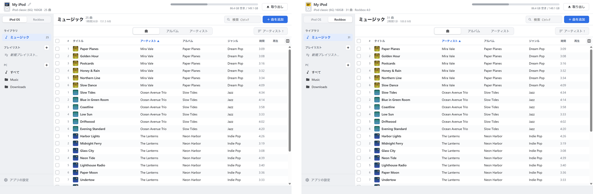
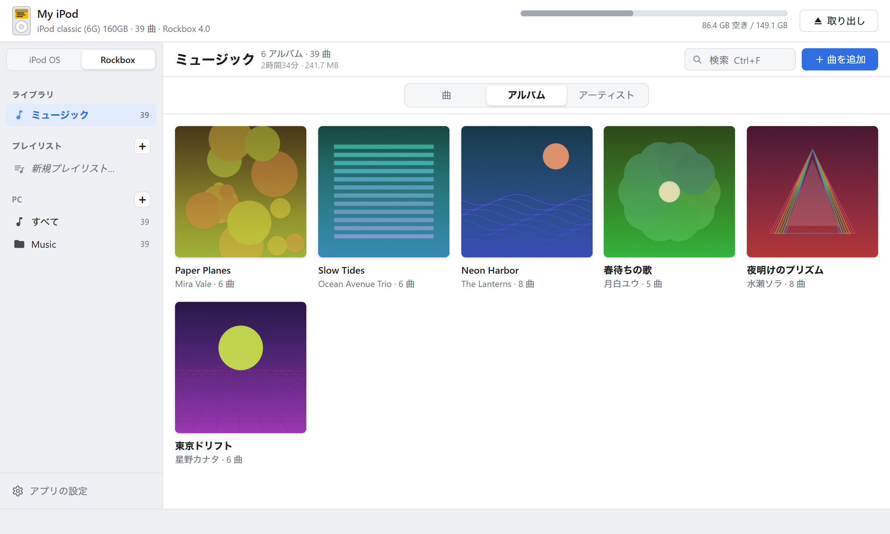
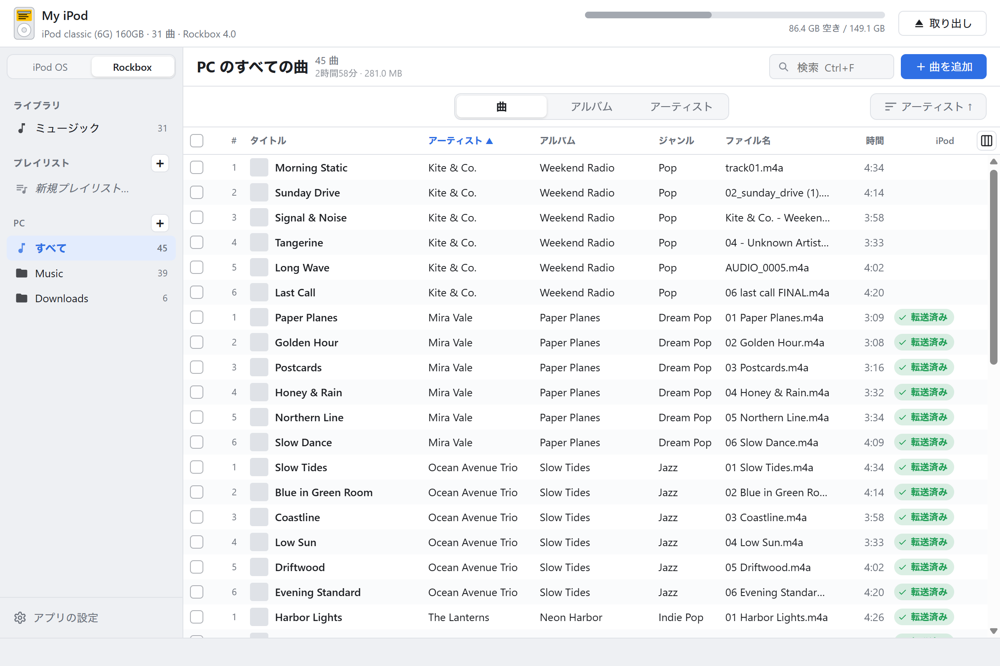
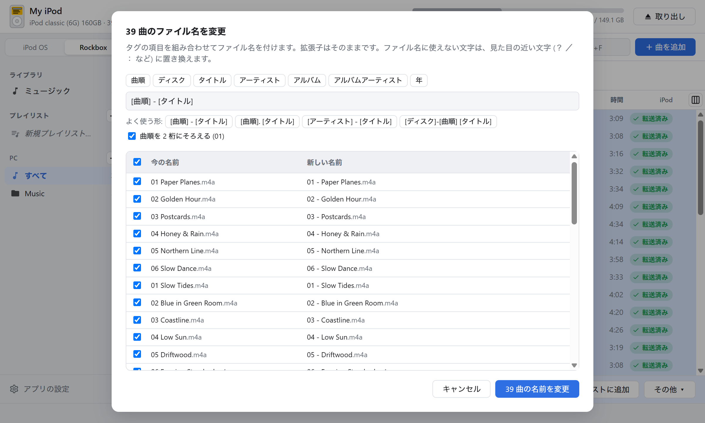
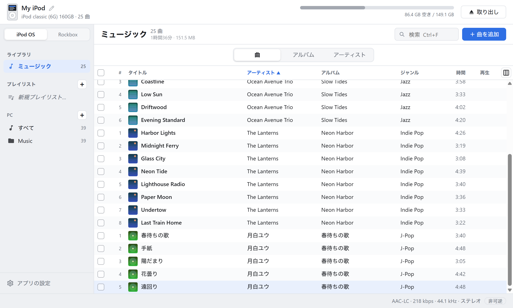
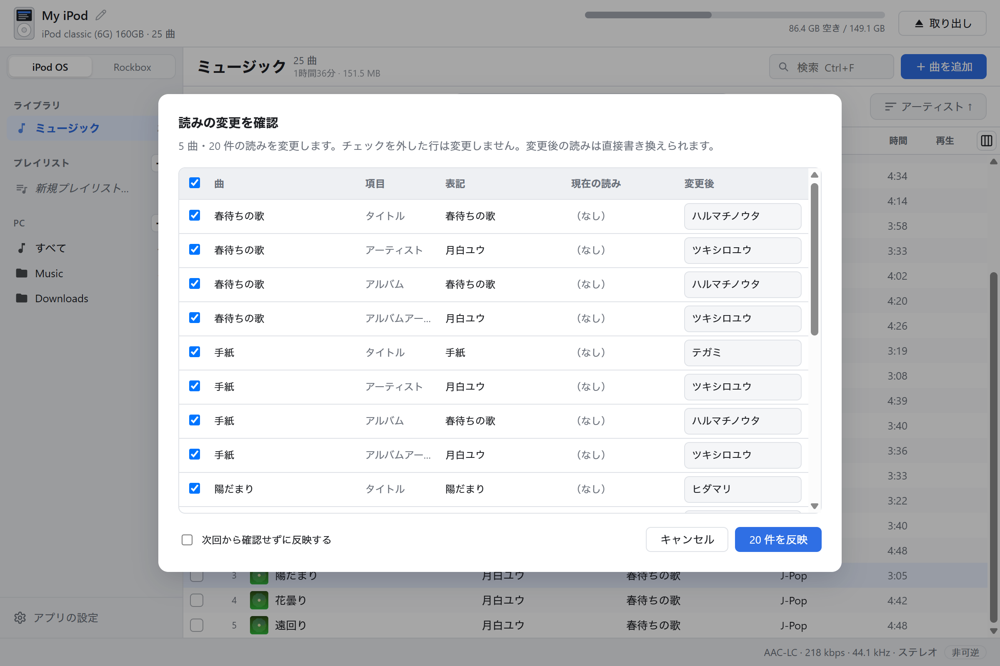
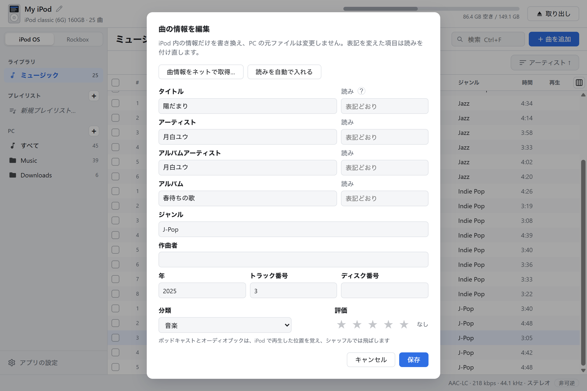
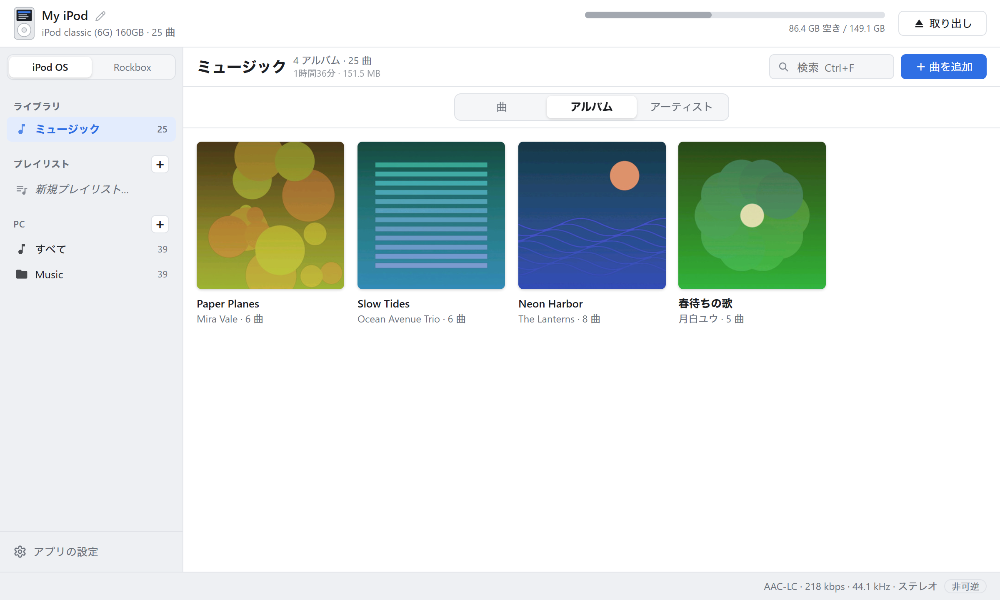

# iPod Sync

**iPod classic の曲を、純正の iPod OS でも Rockbox でも。**

iPod OS（Apple のファームウェア）と Rockbox の両方に対応した、iPod のための音楽管理アプリ。 
ドラッグ＆ドロップで曲を入れられて、PC の音楽ファイルの整理にも使えます。iTunes はいりません。

Windows / macOS 用。**完全無料**（広告なし・有料機能なし・アカウント登録不要）

[**ダウンロード**](https://github.com/ishiichan-dayo/iPod-Sync/releases/latest) ・ [English](README.en.md)

[紹介動画（72 秒・音あり）](https://github.com/ishiichan-dayo/iPod-Sync/releases/download/v1.0.0/ipod-sync-intro-ja.mp4)

---

## iPod OS と Rockbox、どちらでも

左上の「iPod OS | Rockbox」を押すだけで、同じ iPod の曲を 2 つのやり方で管理できます。どちらのモードも、ドロップするだけで転送、曲情報の編集、プレイリストの作成と並べ替えができます。

- **iPod OS**：Apple のファームウェアの曲の一覧（iTunesDB）に登録します。今までの iTunes と同じように使えます
- **Rockbox**：曲をファイルのまま `Music/アーティスト/アルバム/01 曲名.flac` に整理して置きます。**FLAC・Ogg・Opus もそのまま**入ります（変換しません）
- **1 台の iPod で両方**：Rockbox を入れた iPod（デュアルブート）なら、iPod OS 用の曲と Rockbox 用の曲を同じ iPod に入れて使い分けられます。モードは iPod ごとに覚えます

### Rockbox のデータベースを、PC で

Rockbox 本体でデータベースを作ると、曲が多いときは長い時間がかかります。iPod Sync は曲を入れるたびに、**Rockbox 4.0 と同じ形のデータベースを PC で作って**書き込みます。iPod を取り出せば、すぐに「データベース」からアーティスト・アルバムで曲を探せます。

- 本体で付いた再生回数・評価は、作り直しても引き継ぎます
- iPod OS モードで曲を入れたり消したりしたときも、Rockbox のデータベースを合わせて更新します
- ジャケットは Rockbox が読める形（ベースライン JPEG の `cover.jpg`）でアルバムのフォルダに置きます
- プレイリストは Rockbox の `Playlists/名前.m3u8` に書きます

## 音楽ファイルの整理にも

PC の音楽フォルダを登録すると、iPod と同じ画面で PC の曲を見て、そのまま整理できます。iPod を持っていなくても使えます。

- **タグの編集**：曲名・アーティスト・アルバム・曲順などを、元のファイルに書き込みます。配信サイトが入れた独自のタグは消しません
- **曲情報をネットで取得**：MusicBrainz でアルバムを探して、曲名や曲順をまとめて入れられます
- **アートワーク**：画像ファイルから設定したり、ネットで探したりできます（iTunes / Deezer / MusicBrainz）
- **ファイル名の一括変更**：タグから「01 - 曲名」のような名前をまとめて付けられます。変える前に一覧で確かめられて、行ごとに外せます
- **iPod に入れ済みかが分かる**：iPod にある曲には印が付くので、足りない曲だけ選んで送れます

## できること

- **ドロップするだけで転送**：曲やアルバムのフォルダをウィンドウに落とすだけ。プレイリストの上に落とせば、そのプレイリストにも入ります
- **どんな形式でも入る**：iPod OS では MP3 / AAC / ALAC / WAV / AIFF はそのまま、FLAC / Ogg / Opus / WMA などは自動で変換します（可逆 → ALAC、非可逆 → AAC 256kbps。変換後の形式は選べます）。Rockbox ではほとんどの形式をそのまま入れます
- **アートワークも一緒に**：曲に埋め込まれた画像、なければ同じフォルダの `cover.jpg` などを使います
- **評価・ポッドキャスト・オーディオブック**：曲に ★ の評価を付けられます。ポッドキャストとオーディオブックは転送のときにタグなどから見分け、iPod OS では「ポッドキャスト」「オーディオブック」として、再生した位置を覚えるように入れます。Rockbox では `Podcasts` / `Audiobooks` のフォルダに置きます。分類は「情報を編集」からあとで変えられます
- **iPod の中身を見る・整える**：曲 / アルバム / アーティストの表示切り替え、再生、曲情報の編集、プレイリストの作成と並べ替え、PC への書き出し
- **自動アップデート**：新しい版が出ると起動時にお知らせ。ワンクリックで更新できます

## 日本語の曲が、iPod でちゃんと並ぶ

iPod OS は曲名やアーティスト名の「読み」で並べ替えます。読みが無い日本語の曲は、本体の一覧で後ろにまとめて押しやられてしまいます。

iPod Sync は転送するときに読みを自動で付けます（「椎名林檎」→「シイナリンゴ」）。辞書（IPADIC）を内蔵しているので、ネットにはつながりません。

- iTunes で入れた曲など、すでに iPod にある曲にもまとめて読みを付けられます
- 付ける前に「元の表記・今の読み・変更後」を一覧で確認できます。行ごとに外したり、読みを書き換えたりもできます
- 人名などで読みを誤ることがあります（例：米津玄師 → ヨネツゲンシ）。曲情報の編集画面でいつでも直せます

## アルバム表示

## 対応機種

| 機種 | iPod OS | Rockbox |
| --- | --- | --- |
| iPod classic 6G / 6.5G / 7G（80・120・160GB） | ○ | ○ |
| iPod video 5G / 5.5G | ○ | ○ |
| iPod nano 3G / 4G | ○ | × |
| iPod photo・iPod nano 1G / 2G | ○ | ○ |
| iPod 1G〜4G（白黒液晶）・iPod mini 1G / 2G | ○（画面がアートワーク非対応のため曲のみ） | ○ |
| iPod nano 5G 以降・iPod touch | ×（読み取りのみ） | × |
| iPod shuffle | × | × |

- Rockbox モードは、iPod に Rockbox（4.0 以降）が入っていれば使えます。実機での確認は iPod classic で行っています。Rockbox の入れ方は [Rockbox 公式サイト](https://www.rockbox.org/) の Rockbox Utility を使ってください（このアプリは Rockbox 本体やブートローダーは入れません）
- iFlash などで SD カードに換装した iPod も、普通の iPod と同じように使えます
- **Windows では Windows 形式（FAT32）の iPod が必要です。** Mac 形式（HFS+）の iPod は Windows から読めないため、iTunes で「復元」して Windows 形式に初期化してください。macOS ではどちらの形式でも使えます
- iPod 1G / 2G は FireWire 接続のため、今の PC につなぐには別の機器が必要です

## ダウンロード

[最新版のリリース](https://github.com/ishiichan-dayo/iPod-Sync/releases/latest) から、お使いの OS 用のファイルをダウンロードしてください。

| OS | ファイル |
| --- | --- |
| Windows 10 / 11（64 bit） | `iPod.Sync_x.y.z_x64-setup.exe` |
| macOS（Intel / Apple Silicon） | `iPod.Sync_x.y.z_universal.dmg` |

一度インストールすれば、以降はアプリが新しいバージョンを知らせてくれます。

### 初回起動時の注意

アプリにはまだコード署名をしていないため、初回だけ警告が出ます。

- **Windows**：「Windows によって PC が保護されました」と表示されたら「詳細情報」→「実行」
- **macOS**：Finder でアプリを右クリック →「開く」

### ffmpeg について

iPod OS モードで FLAC などを変換して転送するには ffmpeg が必要です（MP3 / AAC / ALAC / WAV / AIFF だけなら不要。Rockbox モードでは基本的に要りません）。

- **Windows / macOS**：アプリの設定画面からワンクリックで入れられます
- **macOS の FLAC** は、ffmpeg が無くても Mac の機能で変換します（Ogg / Opus / WMA などには ffmpeg が必要）

## 使い方

1. iPod を USB でつないでアプリを起動します。iPod は自動で見つかります
2. Rockbox が入っている iPod は、左上の「iPod OS | Rockbox」でモードを選びます
3. 曲・アルバムのフォルダをウィンドウにドラッグ＆ドロップします
4. 終わったら「取り出し」を押してからケーブルを抜きます

右クリックメニューから、削除・書き出し・プレイリストへの追加・曲情報や読みの編集・ファイル名の変更・アートワークの設定ができます。

## 安心して使うために

- iPod OS：初めて開いた iPod の元のデータベースを `iPod_Control/iTunes/iTunesDB.ipodsync-backup` に残します。困ったときはこれを `iTunesDB` に戻せば元どおりです
- Rockbox：初めてデータベースを作り直す前に、元のデータベースを `.rockbox/ipodsync-db-backup/` に残します。うまく動かないときは、本体の「データベース → 今すぐ更新」でも作り直せます
- データベースは一時ファイルに書いてから置き換えるので、書き込みの途中で止まっても壊れにくくしています
- iTunes / ミュージック.app の「自動同期」が有効だと、このアプリで入れた曲が消されることがあります。iTunes 側は「手動で管理」にしてください
- ネットに接続するのは、アートワーク・曲情報のネット検索、ffmpeg の導入、更新の確認のときだけです（検索ではアーティスト名・アルバム名を各サービスに送ります）

## 制限事項

- スマートプレイリストの作成・編集には対応していません（既存のスマートプレイリストはそのまま残ります）
- 動画は転送できません
- Rockbox 本体・ブートローダー・テーマの導入は、Rockbox 公式の Rockbox Utility を使ってください

## 不具合の報告・要望

[Issues](https://github.com/ishiichan-dayo/iPod-Sync/issues) にお寄せください。iPod の機種（画面の左上に表示されます）・モード（iPod OS / Rockbox）・OS を書いていただけると助かります。

## 応援

iPod Sync は個人で開発している無料のアプリです。気に入っていただけたら、[Ko-fi](https://ko-fi.com/ishiichan_dayo) で応援していただけるとうれしいです。開発を続ける励みになります。

---

iPod・iTunes は Apple Inc. の商標です。このソフトウェアは Apple とも Rockbox プロジェクトとも関係ありません。
